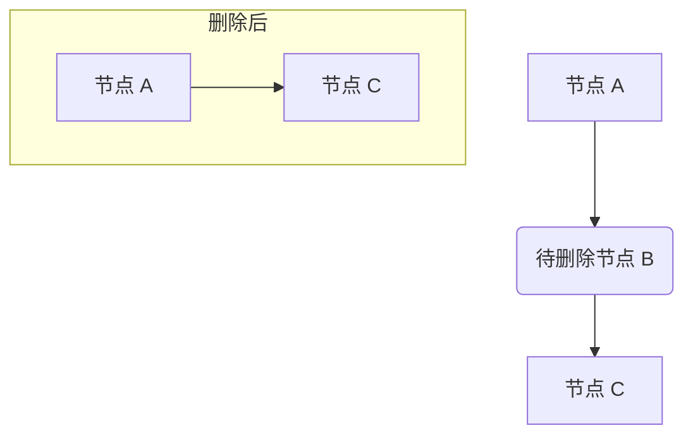
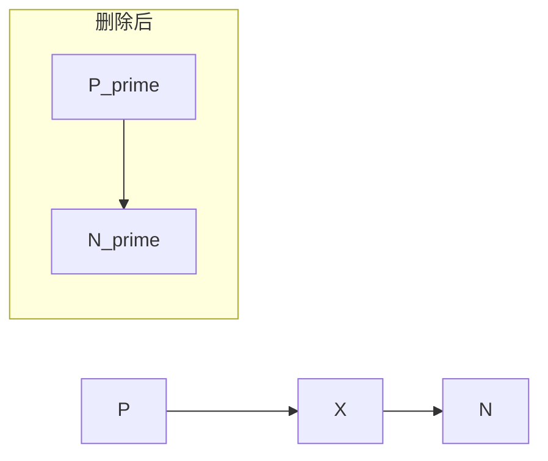

## 引言
链表作为计算机科学中最基础且核心的数据结构之一，其灵活性主要体现在节点的动态增删上。其中，删除节点操作看似只是简单的指针重定向，但它实际上是通往理解更深层次计算原理的一扇门，其背后蕴含着从算法设计美学到硬件性能优化，再到内存安全与并发控制的广阔世界。许多初学者仅仅停留在实现删除功能的层面，却忽略了这一基本操作在现代计算体系中所引发的连锁反应。本文旨在填补这一认知鸿沟，揭示一个简单动作背后复杂的权衡与考量。

我们将分三个阶段展开这场探索之旅。首先，在“原理与机制”一章中，我们将深入剖析删除操作的本质，从[哨兵节点](@article_id:638237)的引入到无锁并发的挑战，层层揭示其内部的精妙设计。接着，在“应用与[交叉](@article_id:315017)联系”一章，我们将跨越学科边界，探寻[链表删除](@article_id:638324)如何在文本编辑器、操作系统乃至生物信息学中扮演关键角色。最后，在“动手实践”部分，你将通过解决一系列精心挑选的编程问题，将理论知识转化为真正的实践能力。准备好从一个简单的节点删除操作开始，重新审视[数据结构](@article_id:325845)与现代计算系统的深刻联系吧。

## 原理与机制

在上一章中，我们已经对链表这一数据结构有了初步的认识。现在，让我们像物理学家探索自然法则一样，深入其内部，探究其运作的核心原理与机制。我们将从一个看似简单的操作——删除节点——开始我们的旅程。你将看到，这个简单的动作背后，隐藏着从[算法](@article_id:331821)巧思到硬件性能，再到内存安全与并发控制的广阔天地。这趟旅程将揭示，计算机科学中最优雅的思想，往往源于对最基本问题的深刻洞察。

### 解开链条：删除的本质

想象一列长长的火车，每一节车厢（节点）都通过挂钩（指针）连接着下一节车厢。从这列火车中移除一节车厢，我们该怎么做？最直观的方法是：找到待移除车厢的前一节，解开它与待移除车厢的挂钩，然后将这个挂钩直接连接到待移除车厢的后一节上。



这个“绕行”或“旁路”（bypass）的操作，就是[链表删除](@article_id:638324)的核心。在最简单的**[单向链表](@article_id:640280)**中，每个节点只有一个指向后继者的 `next` 指针。要删除节点 $B$，我们必须访问它的**前驱节点** $A$，然后执行一步关键的指针重定向：`A.next = B.next`。

这个简单的规则立刻引出了一个棘手的问题：如果要删除的是链表的第一个节点（头节点）呢？头节点没有前驱节点。它的“前驱”是整个链表对象的头指针本身。因此，删除头节点需要一个特殊的处理逻辑：直接修改链表的头指针，使其指向原来的第二个节点。

```
// 删除中间节点
predecessor.next = node_to_delete.next;

// 删除头节点
list.head = head_to_delete.next;
```

这种代码中的 `if/else` 分支，虽然功能上正确，却破坏了[算法](@article_id:331821)的统一性与美感。它就像一个物理定律在某个特殊点突然失灵，需要一个“补丁”才能继续工作。难道没有更优雅的、能够统一所有情况的方法吗？

### 幽灵节点：哨兵的优雅

答案是肯定的，这正是[算法设计](@article_id:638525)之美的体现。我们可以引入一个“幽灵”般的辅助节点，它不存储任何实际数据，我们称之为**[哨兵节点](@article_id:638237)**（Sentinel Node）或**虚拟头节点**（Dummy Head）。我们将这个[哨兵节点](@article_id:638237)放置在原始链表的头部之前，让它的 `next` 指针指向原来的头节点。

```mermaid
graph TD
    S([哨兵节点](@article_id:638237)) --> A[头节点 A]
    A --> B[节点 B]
    B --> C[节点 C]
```

通过引入哨兵，奇迹发生了：**链表中的每一个实际数据节点，包括头节点，现在都有了一个明确的前驱节点！** 头节点 $A$ 的前驱现在是[哨兵节点](@article_id:638237) $S$。如此一来，删除任何位置的节点，无论是头节点、中间节点还是尾节点，都可以统一为同一种操作：找到待删除节点的前驱 `p`，然后执行 `p.next = p.next.next`。

-   **删除头节点 $A$**：此时 `p` 就是[哨兵节点](@article_id:638237) $S$。`S.next = S.next.next` 正确地将哨兵指向了原来的第二个节点 $B$，使得 $B$ 成为了新的头节点。
-   **删除中间节点 $B$**：此时 `p` 是节点 $A$。`A.next = A.next.next` 正确地将 $A$ 指向了 $C$，绕过了 $B$。
-   **删除尾节点 $C$**：此时 `p` 是节点 $B$。`B.next = B.next.next` 正确地将 $B$ 的 `next` 指针设为 `null`，因为 $C$ 的 `next` 是 `null`。

这个小小的[哨兵节点](@article_id:638237)，以 $O(1)$ 的微小空间代价，消除了代码中的 `if/else` 分支，让删除逻辑变得纯粹而统一。这正是计算机科学家追求的“形式之美”。

### 双向奔赴与循环之舞

[单向链表](@article_id:640280)的世界是线性的、单向的。但有时我们需要更灵活的移动能力，比如能够方便地回溯到前一个节点。为此，我们可以给每个节点增加一个 `prev` 指针，指向它的前驱，这就构成了**[双向链表](@article_id:642083)**。

在[双向链表](@article_id:642083)中，删除一个节点 $X$（假设它有前驱 $P$ 和后继 $N$）变得更加“对称”。我们不仅要让 $P$ 绕过 $X$ 指向 $N$，还要让 $N$ 绕过 $X$ 指向 $P$。这需要两步指针操作：

1.  `P.next = N`
2.  `N.prev = P`



这种结构的代价是每个节点需要额外的存储空间来存放 `prev` 指针，并且插入和删除操作需要维护更多的指针，但它提供了无与伦比的遍历灵活性。

我们甚至可以更进一步，将[链表](@article_id:639983)的“终点”和“起点”连接起来，形成一个环。在**双向[循环链表](@article_id:640072)**中，头节点的 `prev` 指针指向尾节点，而尾节点的 `next` 指针指向头节点。这样的结构没有了“终点”的概念，从任何一个节点出发，你都可以遍历整个[链表](@article_id:639983)。删除操作的逻辑与普通[双向链表](@article_id:642083)类似，只是在处理头、尾节点时需要格外小心，确保环的完整性不被破坏 。

### 看不见的代价：与硬件的对话

到目前为止，我们一直在一个抽象的、数学的世界里讨论指针和节点。但当程序在真实的计算机上运行时，这些操作会转化为对内存的访问，而这背后隐藏着巨大的性能差异。让我们来倾听一下硬件的心声。

现代计算机的 CPU 速度极快，但访问主内存（RAM）却相对缓慢。为了弥补这一差距，CPU 内部设置了多级高速缓存（Cache）。你可以把 Cache 想象成 CPU 办公桌上一个很小的、但取用极快的书架，而主内存则是远在另一栋大楼里的巨大图书馆。当 CPU 需要数据时，它会先看书架上有没有。如果有（**缓存命中**，Cache Hit），它能立刻拿到。如果没有（**[缓存](@article_id:347361)未命中**，Cache Miss），它就必须派人去图书馆取，这会花费很长时间。为了提高效率，每次去图书馆取书时，它不会只取一本，而是会把那本书以及它旁边书架上的一整排书（一个**缓存行**，Cache Line，通常是 64 字节）都搬回来，因为它猜测你可能很快会用到旁边的书（**[空间局部性](@article_id:641376)**原理）。

现在，我们来看看这对链表意味着什么。[链表](@article_id:639983)的节点通常是在程序运行时动态分配的，它们在主内存中的物理地址可能是随机散布的，就像图书馆里的书被胡乱地放在各个角落。当你遍历一个[链表](@article_id:639983)时，`current = current.next` 这条指令，实际上是一次**指针追逐**（Pointer Chasing）。你读取当前节点的 `next` 指针，得到一个内存地址，然后跳转到那个地址去访问下一个节点。

这个过程对于 CPU 缓存来说是灾难性的。由于下一个节点的物理地址与当前节点毫无关系，它极大概率不在任何已加载的缓存行中。因此，每一步遍历几乎都会导致一次代价高昂的[缓存](@article_id:347361)未命中。CPU 不得不一次又一次地往返于遥远的“图书馆”，性能大打折扣。

让我们通过一个思想实验来感受这种差异 。假设我们有一个包含 10000 个节点的[链表](@article_id:639983)，并执行两种删除任务：
1.  **任务 H**：连续删除 1000 次头节点。
2.  **任务 M**：连续删除 1000 次随机位置的中间节点。

在任务 H 中，每次删除都只涉及[链表](@article_id:639983)的头部。CPU 只需要访问第一个和（或许）第二个节点。这些节点的内存地址被加载到[缓存](@article_id:347361)后，可能会在短时间内被再次访问，具有良好的**[时间局部性](@article_id:335544)**。因此，总的缓存未命中次数大约是 1000 次左右。

而在任务 M 中，情况天差地别。每次删除都需要从头节点开始，平均遍历约 5000 个节点才能找到目标位置。每一次 `current = current.next` 的跳转，都像是一次在内存地图上的随机跳跃，几乎百分之百导致缓存未命中。完成这 1000 次删除，总的[缓存](@article_id:347361)未命中次数将是数百万级别！这比任务 H 慢了几个数量级。

这个例子深刻地揭示了，在现代硬件上，[算法](@article_id:331821)的优劣不仅仅取决于其抽象的计算步数（[大O表示法](@article_id:639008)），还严重依赖于其内存访问模式。像[链表](@article_id:639983)这样“对[缓存](@article_id:347361)不友好”的[数据结构](@article_id:325845)，在需要大规模遍历的场景下，其理论上的优势可能会被实际的硬件性能瓶颈所抵消。在最坏的情况下，如果节点的[内存布局](@article_id:640105)被恶意设计（一种**对抗性布局**），使得每一次访问都精确地相互冲突，那么[缓存](@article_id:347361)将完全失效，性能会跌至谷底 。

### 节点的生死轮回：[内存管理](@article_id:640931)的艺术

当一个节点被从[链表](@article_id:639983)中“删除”后，它所占用的内存空间应该何去何从？这个问题将我们带入了一个更深层次的领域：[内存管理](@article_id:640931)。

在 C/C++ 等语言中，程序员需要手动释放（`free` 或 `delete`）不再使用的内存。如果忘记释放，就会导致**[内存泄漏](@article_id:639344)**——被遗弃的内存无法被再次使用，最终耗尽系统资源。然而，手动管理内存充满了陷阱，比如**悬垂指针**（Dangling Pointer，指向已被释放内存的指针）和**重复释放**（Double Free）。

为了解决这些问题，现代编程语言和系统发展出了多种自动[内存管理](@article_id:640931)技术。链表的删除操作，正是这些技术应用的绝佳舞台。

#### 方案一：强弱分明，打破循环

让我们回到[双向链表](@article_id:642083)。节点 $A$ 的 `next` 指向 $B$，节点 $B$ 的 `prev` 指向 $A$。如果我们使用一种简单的**引用计数**（Reference Counting）机制——即每个对象记录有多少个指针指向它，当计数值归零时自动释放——会发生什么？

$A$ 指向 $B$，所以 $B$ 的引用计数至少为 1。$B$ 指向 $A$，所以 $A$ 的引用计数也至少为 1。它们形成了一个**引用循环**。即使整个[链表](@article_id:639983)都从外部不再被访问，$A$ 和 $B$ 依然相互“支撑”，导致它们的引用计数永远无法归零。这是一个经典的[内存泄漏](@article_id:639344)场景。

解决之道，是区分指针的“强弱” 。我们可以规定：
-   `next` 指针是**强引用**（Strong Reference）。它代表着“所有权”，只要存在一个强引用指向一个节点，该节点就必须存活。
-   `prev` 指针是**弱引用**（Weak Reference）。它只是一种“观察”，不计入引用计数，不阻止节点被销毁。

通过这种设计，`A` 对 `B` 拥有所有权，但 `B` 对 `A` 只是观察。所有权的链条是单向的（$A \rightarrow B \rightarrow C \dots$），不再有环。当外界不再有强引用指向 $A$ 时，$A$ 就会被销毁。销毁 $A$ 会解除它对 $B$ 的强引用。如果此时没有其他强引用指向 $B$，$B$ 也会被销毁，以此类推，整个[链表](@article_id:639983)被安全地、依次地回收。当你想通过弱引用访问一个节点时，系统会先检查它是否还“活着”，如果它已经被销毁，弱引用会安全地返回一个空值，避免了悬垂指针。这种“强 `next`，弱 `prev`”的设计，是 Rust、Swift 等现代系统语言中实现安全、高效的[双向链表](@article_id:642083)的标准[范式](@article_id:329204)。

#### 方案二：池化管理，循环利用

在某些高性能场景下，频繁地向操作系统申请和释放内存本身就是一种开销。我们可以采取一种更务实的策略：**节点池化**（Node Pooling）。

当我们“删除”一个节点时，我们并不立即将其内存返还给操作系统，而是将其放入一个我们自己管理的“回收箱”里，这个回收箱通常被称为**空闲列表**（Free List）。当需要插入一个新节点时，我们首先检查回收箱里有没有可用的旧节点。如果有，就直接拿出来，更新其数据后重新链入主链表；如果没有，才向操作系统申请新的内存。

这种方法将删除操作变成了将节点移动到另一个列表的内部操作，将插入操作变成了优先从内部列表获取节点的操作。这大大减少了与操作系统的交互，对于需要频繁增删节点的应用（如实时系统、游戏引擎）来说，是一种非常有效的性能优化手段。

#### 方案三：懒汉哲学，延迟删除

还有一种策略，被称为**懒惰删除**（Lazy Deletion）。当需要删除一个节点时，我们不去动任何指针，只是在该节点上做一个标记，比如设置一个 `is_deleted` 的布尔值为 `true`。这个节点在逻辑上被删除了，但物理上仍然存在于[链表](@article_id:639983)中。

这样做的优点是删除操作本身变得极其快速，只需一次内存写入。当然，代价是链表中会混杂着“活”节点和“死”节点，遍历时需要跳过那些被标记的节点。当被标记的节[点积](@article_id:309438)累到一定程度时，我们可以启动一个**[垃圾回收](@article_id:641617)**或**紧凑化**（Compaction）的过程，一次性地遍历整个链表，将所有被标记的节点真正地物理移除。

这种“标记-清扫”（Mark-and-Sweep）的思想是许多自动[垃圾回收](@article_id:641617)系统的基础，也广泛应用于数据库和[文件系统](@article_id:642143)中。它通过批处理的方式，将多次零散的删除开销均摊到一次集中的维护操作中，从而在特定负载下获得更高的吞吐量。

### 终极挑战：并发世界中的原子操作

我们迄今为止的讨论，都基于一个隐含的假设：只有一个“工人”（线程）在操作链表。但现代计算机拥有多个 CPU 核心，程序往往会派发多个工人同时工作以提高效率。如果两个工人同时尝试删除链表中相邻的两个节点，会发生什么？

这会导致**[竞态条件](@article_id:356595)**（Race Condition）。工人甲可能正在读取节点 $P$ 的 `next` 指针，准备将其修改为指向 $Q$。就在此时，工人乙可能已经修改了 $P$ 的 `next` 指针。当工人甲完成它的操作时，它写入的是一个过时的、无效的值，最终导致[链表](@article_id:639983)结构被破坏。

传统的解决方案是使用**锁**（Lock）。在修改[链表](@article_id:639983)前，工人必须先获取一把“锁”，操作完成后再释放。这确保了在任何时刻，只有一个工人能够修改链表，从而避免了冲突。但锁本身也带来了新的问题：它会降低并行度，可能导致死锁，并且在高竞争下性能不佳。

有没有办法在不使用锁的情况下安全地修改[链表](@article_id:639983)？答案是肯定的，这需要借助硬件提供的一种特殊武器：**原子操作**（Atomic Operations）。其中最著名的是**比较并交换**（Compare-And-Swap, CAS）。

CAS 指令可以这样理解，它对一个内存地址执行一个三元操作 `CAS(address, expected_value, new_value)`：
> “我希望将地址 `address` 上的值从 `expected_value` 修改为 `new_value`。请先检查该地址当前的值是否仍然是 `expected_value`。如果是，就执行修改并告诉我成功了；如果不是（说明在我检查后有别人修改了它），就什么也别做，告诉我失败了。”

整个过程是**原子的**，意味着它要么完全成功，要么完全失败，绝不会被中途打断。

利用 CAS，我们可以设计出精妙的**无锁**（Lock-Free）[链表删除](@article_id:638324)[算法](@article_id:331821)。其核心思想与懒惰删除有异曲同工之妙，但每一步都由 CAS 来保证原子性：

1.  **逻辑删除（标记）**：首先，找到要删除的节点 `curr`。然后，使用 CAS 尝试将其 `next` 指针（或一个与之关联的标记位）原子地标记为“已删除”。这是删除操作的“官宣”时刻，一旦成功，该节点在逻辑上就永远地从[链表](@article_id:639983)中移除了。如果 CAS 失败，说明有其他线程抢先修改了 `curr`，我们只需简单地从头开始重试整个过程。

2.  **物理删除（解链）**：在节点被标记后，我们需要更新其前驱 `pred` 的 `next` 指针，以物理地绕过它。这一步同样使用 CAS 完成：`CAS(pred.next, curr, curr.next)`。这一步可以看作是“善后工作”。

这个[算法](@article_id:331821)最巧妙的一点在于它的**协作性**。任何线程在遍历链表时，如果遇到一个被标记的节点，它都有义务“帮助”完成物理删除的第二步。也就是说，即便发起删除的线程在标记后被挂起，其他线程也能确保被标记的节点最终会被从链中断开，从而保证整个系统的持续推进（这就是[无锁算法](@article_id:639621)的“活性”保证）。

当然，无锁编程的深渊中还潜藏着“[ABA问题](@article_id:640778)”等更复杂的魔鬼，需要通过在指针中[嵌入](@article_id:311541)版本号等技术来解决。但这已经超出了我们本次旅程的范围。

从一个简单的指针修改，到考虑硬件[缓存](@article_id:347361)、内存安全，再到应对并发冲突，我们对“[链表删除](@article_id:638324)”的探索，实际上是在层层深入地理解现代计算系统的复杂性与精妙设计。每一个问题的解决方案，都闪耀着计算机科学的智慧之光，展现了在约束中寻求最优解的艺术。